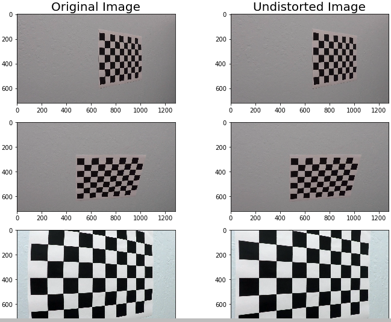
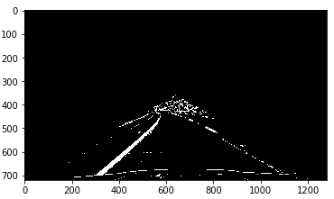
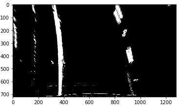
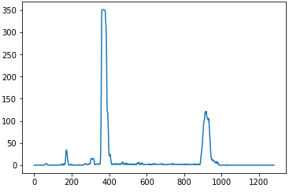
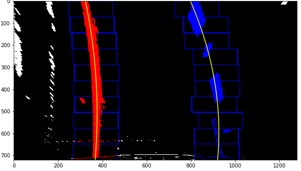
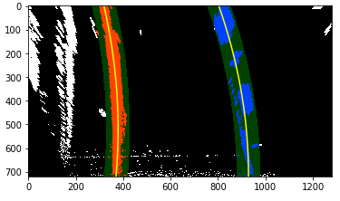
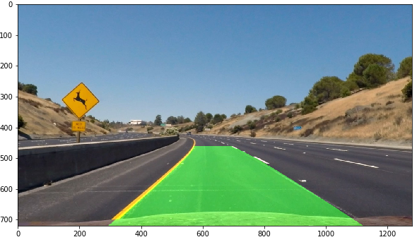

## Advance Lane Finding

In this Repository resourses used provided by Udacity
```


```
## Camera Calibration
In the camera Calibration Step we would have some test images in test folder (chessboard image) through which we have calibrate camera image or removing destortion. in this section we will find the cameraMetrix and distortionMetrix through which we can undestorted another images.



```


```
## Thresholding 
### Image Processing
In this section we will apply some color selction and edge selection tools and we will find the best output of white and yellow lines as shown in pictute

``` Pyhton
thres_binary=image_process(image)

```


```


```
## ProsPective Trasformation
### Bird Eye View
In this Section Image convert into bird eye view to get more information about the curve of line.
Three is tool called wrap prospective Transformation which do this task.
```
warped = cv2.warpPerspective(thres_binary.astype('float32'), M, image_size,flags=cv2.INTER_LINEAR )

```
            warped Image



```


```
### Finding Base Line cordinates
Using Histogram technique we will find out the lane base cordinates. The hack is where histogram having highest frequency that will be our line.


```


```
## Sliding Window Search
In this Section we will apply sliding window search algorithum and will find out best fit second degree polynomial
```
#window search and gettinig polynomial
polyfit_left,polyfit_right,y_points,image_d =window_search(warped,leftx_base,rightx_base)

#calculating x corrdinates
left_x_predictions = polyfit_left[0]*y_points**2 + polyfit_left[1]*y_points + polyfit_left[2]

right_x_predictions = polyfit_right[0]*y_points**2 + polyfit_right[1]*y_points + polyfit_right[2]

```

```


```
### Normal Line Search (line search around past lines)
The Window search only apply when pipeline will not find the line or any bad frame. In this Code section we made 50 px boundary around the previous line, For next frames we will search line within this boundary untill bad frame comes



## OutPut
Finally we get the predicted lines now we will draw a polynomial with the help of predicted lines cordinates.


### Issuse
1. to get the best result of thresholding I had tune several time the threshold points and i had tried varoius combination of thresholding to get yellow and white lines

2. In some Bad Frame or low light are or darker frame this code get confused and not work well

### Improvement

1. This code is working fine but in some case when bad frame comes in that condition we will check the we getting line or not if we not get any line the we will take help from previours detected line and will draw an avarage line 
